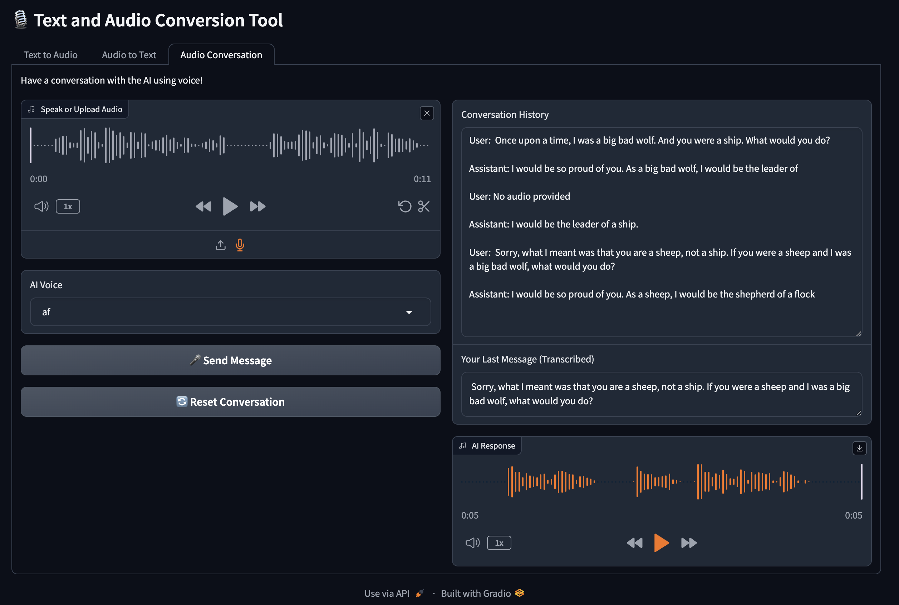

# VoiceBridge: A Speech-to-Speech (STS) Application

This repository contains a Text-to-Speech, Speech-to-text, and Speech-to-Speech application that is dockerized and easy to use. The application allows you to convert text to audio, transcribe audio to text using Whisper, and have back-and-forth conversations with an LLM. The LLM used is [meta-llama/Llama-3.2-1B-Instruct](https://huggingface.co/meta-llama/Llama-3.2-1B-Instruct).



## Prerequisites

- Docker installed on your machine

## Running the Application

1. **Clone the repository:**

    ```sh
    git clone https://github.com/Amir-Mohseni/VoiceBridge.git
    cd VoiceBridge
    ```

2. **Build the Docker image:**

    ```sh
    docker build -t vb-app .
    ```

3. **Run the Docker container:**

    ```sh
    docker run -it --rm -p 7860:7860 vb-app
    ```

    This will start the application and map port 7860 of the container to port 7860 on your host machine.

4. **Access the application:**

    Open your web browser and navigate to `http://127.0.0.1:7860` to use the application.

## Features

- **Text to Audio:** Convert text to speech using various voices.
- **Audio to Text:** Transcribe audio files to text using Whisper.
- **Audio Conversation:** Have a conversation with the AI using voice input and receive voice responses.

## Files

- `main.py`: The main script to run the application.
- `text2audio.py`: The script for converting text to audio.
- `transcriber.py`: The script for transcribing audio to text.
- `llm.py`: The script for interacting with the LLM. The Hugging Face model can be easily changed in this file.
- `Dockerfile`: The Dockerfile used to build the Docker image.
- `requirements.txt`: The file containing Python dependencies.

## License

This project is licensed under the MIT License. See the [LICENSE](LICENSE) file for details.

## Contributing

Contributions are welcome! Please open an issue or submit a pull request.
